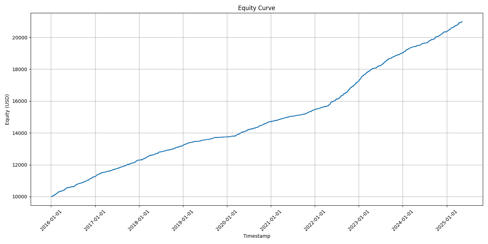

# ML-TA

## Project Overview

ML-TA is a modular, Python-based trading bot designed for MetaTrader 5 (MT5). It features advanced data ingestion, dynamic feature engineering, machine learning model training (with hyperparameter optimization and ensembling), and robust backtesting. The system is engineered for both research and practical trading automation.

---

## Sample Backtest Performance (2016–2025)

Performance below is based on EURUSD/GBPUSD from January 2016 to May 2025 using the full ML-TA pipeline.

> **Note:** The model used for this backtest was trained only on data from 2022 to 2025, then evaluated on the entire 2016–2025 period. This approach demonstrates the model's ability to generalize and reduces the risk of overfitting, as it was not exposed to earlier data during training. Notably, the strategy survived the 2020 COVID market crash, highlighting its robustness in highly volatile conditions.

### Equity Curve



### Performance Report

> **Backtest settings:** All results below use a fixed 0.01 lot size per trade (no dynamic risk or position sizing).

```
Backtest Performance Report (Pre-computed Features Mode)
============================================================
Initial Capital: $10,000.00
Final Equity: $16,000.25
Net Profit/Loss: $6,000.25
Net Profit/Loss (%): 60.00%
Total Closed Trades: 8401
Winning Trades: 4700
Losing Trades: 3701
Win Rate (%): 55.95
Average Win ($): 1.90
Average Loss ($): -0.79
Total Gross Profit ($): 8,922.28
Total Gross Loss ($): -2,922.03
Profit Factor: 3.05
Max Drawdown (%): 0.11%
Max Drawdown ($): $13.68
```

---

## Key Features
- Multi-timeframe analysis: Dynamic H1 support/resistance context, M5 for ML features and trade management
- Automated feature engineering and ML model training (Optuna hyperparameter tuning, ensemble support)
- Realistic backtesting with incremental bar-by-bar simulation
- Flexible risk management (fixed lot or dynamic equity percentage)
- Modular, extensible codebase with clear configuration
- Detailed reporting: equity curve, trade log, performance summary

## Project Structure
```
ML-TA/
├── main.py                     # Main orchestrator script
├── config.py                   # All configuration variables
├── requirements.txt            # Python package dependencies
├── README.md                   # This file
├── .env                        # For MT5 credentials (optional, gitignored)
├── data/                       # For CSV data files
│   ├── EURUSD_M5.csv
│   └── EURUSD_H1.csv
├── models/                     # For saved ML models (.joblib) and feature names (.json)
│   └── EURUSD_M5_XGBClassifier_ensemble_pipeline.joblib
├── reports/
│   ├── logs/
│   └── backtests/
│       ├── trade_log.csv
│       ├── equity_curve.png
│       └── performance_report.txt
├── data_ingestion/
│   └── data_fetcher.py         # Fetches data (MT5/CSV)
├── feature_engineering/
│   ├── indicators.py           # TA calculations
│   ├── market_structure.py     # Dynamic SNR, pivots
│   └── feature_builder.py      # Feature construction
├── ml_models/
│   └── model_manager.py        # Model training, Optuna, ensemble
├── signal_generation/
│   └── signal_processor.py     # Rule-based and ML signal logic
├── execution/
│   ├── mt5_interface.py        # MT5 interaction
│   └── risk_manager.py         # SL/TP, position sizing
├── backtesting/
│   └── backtester.py           # Backtest engine
├── utilities/
│   ├── logging_utils.py        # Logging setup
│   └── file_utils.py           # File operations
```

## Usage
1. Install Python 3.8+ (recommended using Python 3.11) and MetaTrader 5 terminal
2. Clone this repo and set up a virtual environment
3. Install dependencies: `pip install -r requirements.txt`
4. Configure `config.py` and `.env` for your MT5 credentials and data sources
5. Prepare data files in `data/` if using CSVs

### Main Modes
- **Train:**
  - `python main.py --mode train`
  - Fetches/loads data, performs feature engineering, tunes and trains ML models (with Optuna), and saves pipelines for each pair.
- **Backtest:**
  - `python main.py --mode backtest`
  - Loads trained models, simulates trading on historical data with realistic bar-by-bar execution, and generates detailed performance reports.
- **Live:**
  - `python main.py --mode live`
  - Connects to MT5, loads models, and executes trades in real time based on live data and ML-confirmed signals. (Demo account recommended for testing.)

### Utility Options
- `--clear-logs`: Clears all log files in `reports/logs/`.
- `--clear-reports`: Clears all backtest reports in `reports/backtests/`.

## Disclaimer
This software and its content are provided for research and educational purposes only. It is not intended as and does not constitute financial advice, investment advice, trading advice, or any other form of advice. You should not treat any of the project's content as such.

Trading financial markets, especially with automated and machine-learning-based systems, carries a high level of risk and may not be suitable for all investors. Before deciding to trade, you should carefully consider your investment objectives, level of experience, and risk appetite. There is a possibility that you could sustain a loss of some or all of your initial investment. Therefore, you should not invest money that you cannot afford to lose.
